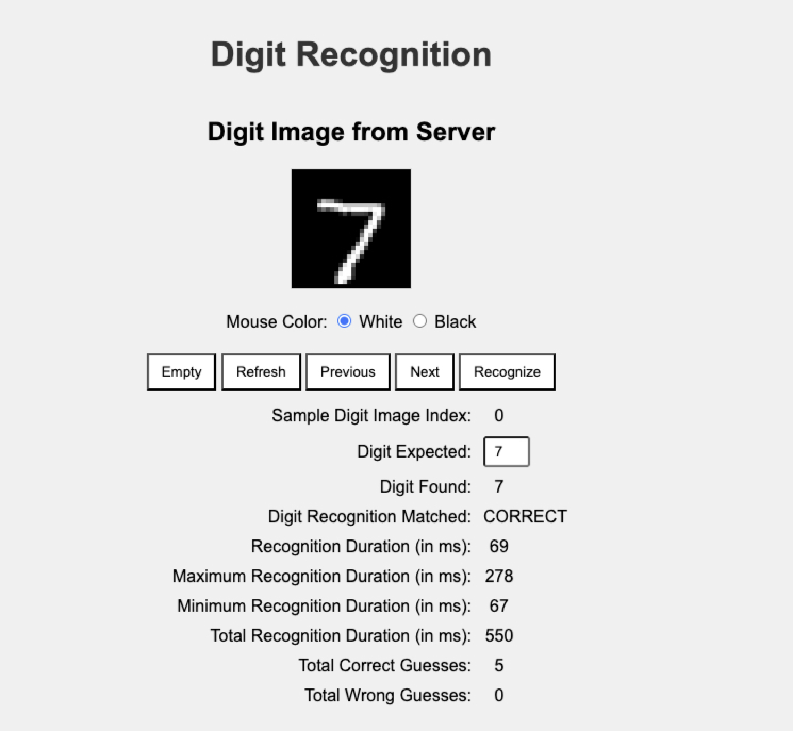

# Digit Recognition by Redis Vector Search with MNIST Dataset in Go 

This repository provides an experimental web service for digit recognitions by Redis Vector Search in
[MNIST Dataset](https://paperswithcode.com/dataset/mnist/) ([csv can be found here](https://git-disl.github.io/GTDLBench/datasets/mnist_datasets/)).
It leverages Redis' RediSearch and RedisJSON modules with a Go implementation inspired by
[Redis Vector Search with MNIST Dataset in Go](https://github.com/mg52/redis-mnist-vector-search/).

The project achieves 96% accuracy, correctly predicting 9691 out of 10 000 test digit samples,
with an efficient average search duration roughly tens of ms, making Redis a powerful solution for high-dimensional data search.

The frontend is managed by JavaScript functions placed in [Frontend](index.html) together with CSS and HTML for simplicity.

The backend is a Go service with the project root in [main.go](digit-recognition.go).

The REST API is defined in the [OpenAPI](openapi.yaml) file. 

## Prerequisites

### Step 1: Go

You need to install Go and set your Go workspace first.

[Go](https://golang.org/) **version 1.24+ is required**

### Step 2: OAPI Codegen

For re-building REST API, you need to install [oapi-codegen](https://github.com/oapi-codegen/oapi-codegen) generator.

### Step 3: Unzip Utility
Install unzip utility if you don't have it yet: 
```
sudo apt-get install unzip
```

### Step 4: Docker and Docker Compose

Lastly, you need to install [Docker](https://www.docker.com/) and [Docker Compose](https://docs.docker.com/compose/) 
for containerized Redis Stack defined in [Docker Compose](docker-compose.yaml).

## Installation

### Step 1: Update dependencies

```
go mod tidy
```

### Step 2: Download and unzip MNIST train and test CSV files

Go to the [MNIST Dataset](https://git-disl.github.io/GTDLBench/datasets/mnist_datasets/) and click on `Download_MNIST_CSV` option.
Store the file into the root folder of the local repository copy.
Note: Please skip replacing the README.md file as you would overwrite this file.

```
unzip MNIST_CSV.zip
```

### Step 3: Generate REST API

```
go generate digit-recognition.go
```

Note: There are generate commands right in [main.go](digit-recognition.go):
```
//go:generate oapi-codegen -package gen -generate chi-server,strict-server -o internal/api/gen/server.go openapi.yaml
//go:generate oapi-codegen -package gen -generate types -o internal/api/gen/types.go openapi.yaml
//go:generate oapi-codegen -package gen -generate spec -o internal/api/gen/spec.go openapi.yaml
```

### Step 4: Run Redis Stack in Docker

```
docker compose up -d
```

## Build

```
go build -o digit-recognition digit-recognition.go
```

## Run

```
./digit-recognition
```

Go to your favorite browser and open the following local [Web page](http://localhost:8880/).

You should be able to see a window similar to this:

You can:

1. Create an empty image to draw a digit by mouse.
2. Refresh the updated digit image. 
3. Retrieve the previous digit sample from the MNIST test set.
4. Retrieve the next digit sample from the MNIST test set.
5. Recognize the digit image as it is currently displayed.
6. Update the expected digit value to compare against the recognition.

Unfortunately, drawn digits from scratch are usually challenging to recognize.
It's caused probably due to pure white pixels (not gray shades as it is in digit samples).

Enjoy !

## Notes

Redis Stack Credentials (also used in [Docker Compose](docker-compose.yaml)):

User: `default`

Password: `redispassword`

## References

https://github.com/redis-stack

https://paperswithcode.com/dataset/mnist/

https://github.com/mg52/redis-mnist-vector-search/

